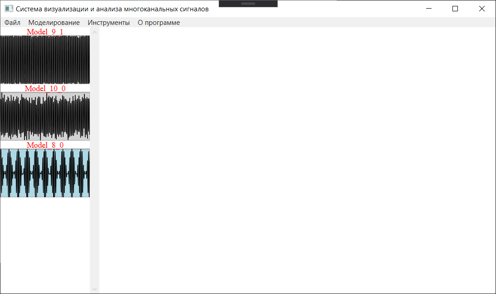
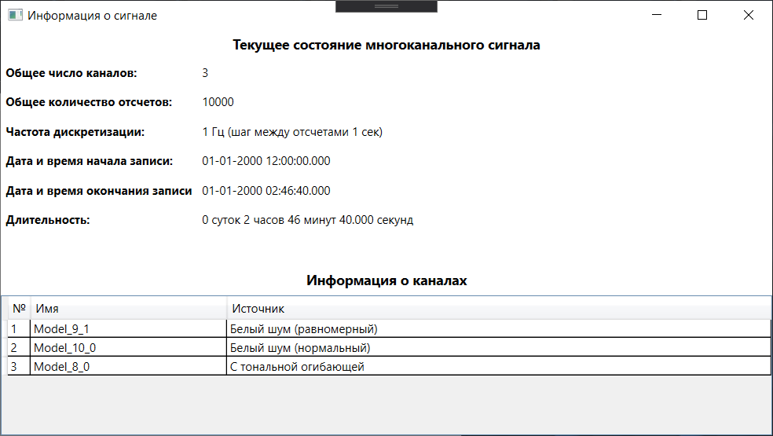
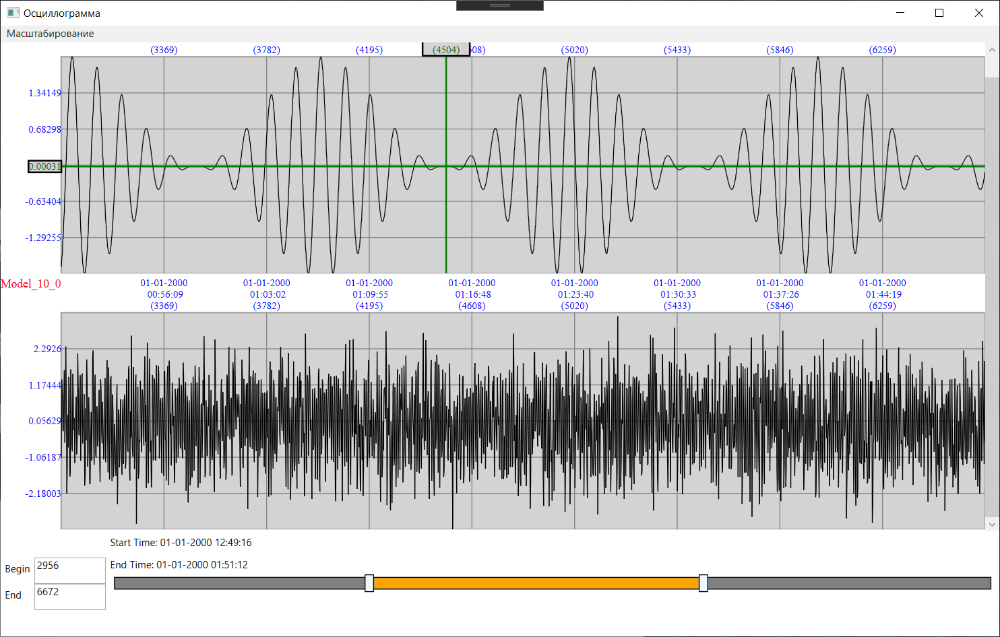
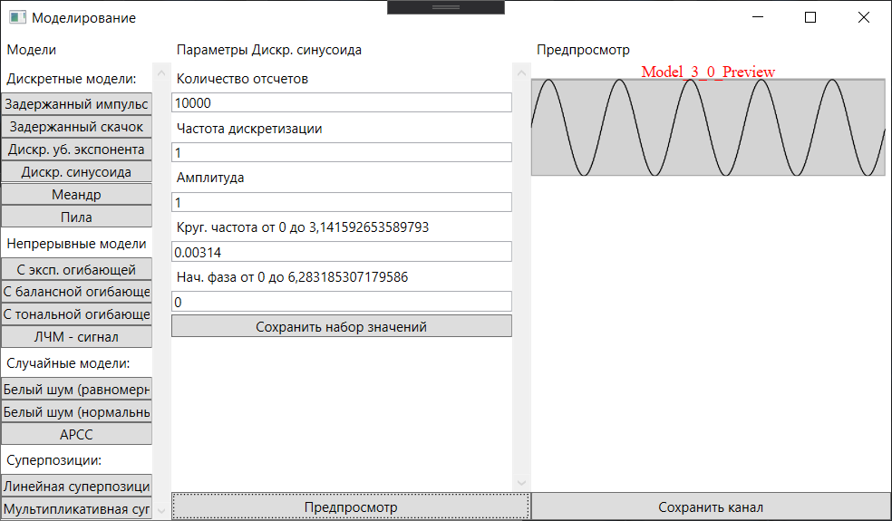
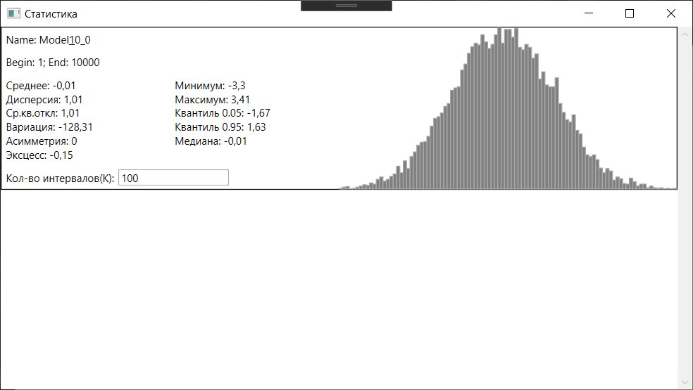
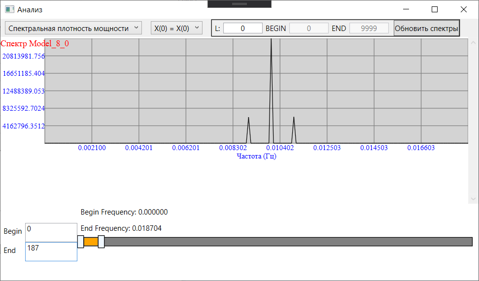
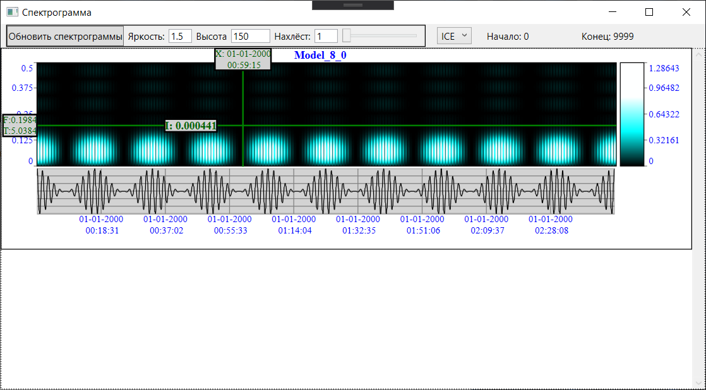
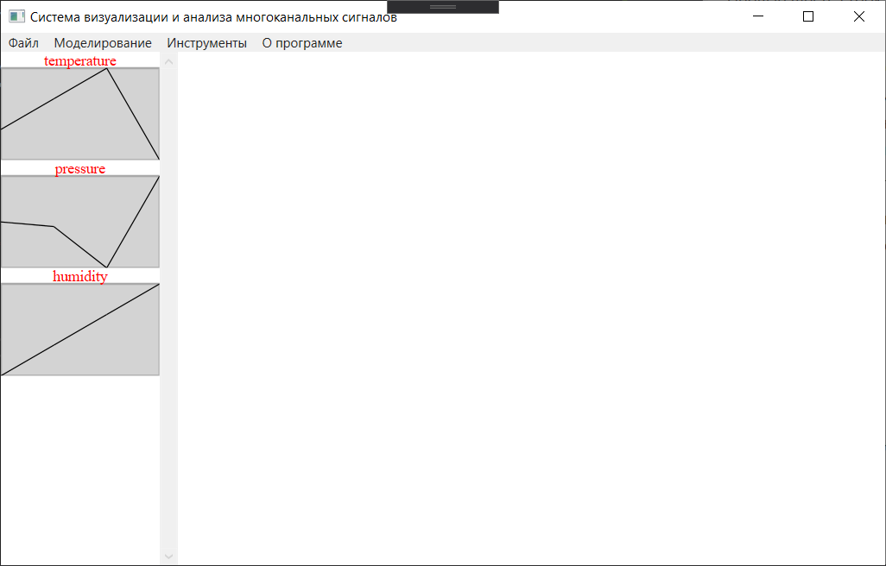

# Проект по компьютерной графике: система визуализации и анализа многоканальных сигналов

## Описание
Программа предоставляет следующие режимы:

1. информация о сигнале
    * число каналов
    * количество отсчётов
    * частота дискретизации
    * дата и время начала и окончания записи
    * длительность
1. визуализация
    * осциллограмма
1. моделирование
    * дискретные модели
        * задержанный импульс
        * задержанный скачок
        * дискретная убывающая экспонента
        * дискретная синусоида
        * меандр
        * пила
    * непрерывные модели
        * с экспоненциальной огибающей
        * с балансной огибающей
        * с тональной огибающей
        * ЛЧМ - сигнал
    * случайные модели
        * белый шум (равномерный)
        * белый шум (нормальный)
        * АРСС
    * суперпозиции
        * линейная
        * мультипликативная
1. статистика
    * среднее арифметическое
    * дисперсия
    * среднее квадратичное отклонение
    * вариацию, асимметрию, эксцесс
    * минимум и максимум
    * квантили 0.05, 0.5, 0.95
    * гистограмма распределения значений
1. анализ
    * спектральная плотность мощности
    * амплитудный спектр
1. спектрограмма

В режиме "моделирование" доступны: предпросмотр моделируемого сигнала,
сохранение набора значений.

В режиме "статистика" доступно изменение кол-ва интервалов для построения
гистограммы распределения значений.

В режиме "анализ" доступны: обычный и логарифмический режимы, настройка
режима разрешения ситуации с нулевым отсчётом (ничего не делать,
обнулить, сделать равным модулю соседнего отсчёта), настройка полуширины
окна сглаживания, выбор интервала частот.

В режиме "спектрограмма" доступны настройки параметров яркости, высоты,
нахлёста и выбор цветовой палитры (GRAY, HOT, ICE, BlueRed).

Режимы "статистика", "анализ" и "спектрограмма" обрабатывают интервал,
выбранный на осциллограмме, если такой не выбран, то обрабатывается
весь канал целиком.

Каждый из режимов позволяет одновременно просматривать несколько каналов.

## Примеры
Основное окно с тремя добавленными каналами.


Окно "Информации о сигнале".


Окно "Осциллограмма" с двумя канали и выбранным интервалом.


Окно "Моделирование". Пример создания дискретной синусоиды.


Окно "Статистика" со статистикой по каналу с белым шумом (нормальным).


Окно "Анализ" с анализом сигнала с тональной огибающей.


Окно "Спектрограмма" со спектрограммой сигнала с тональной огибающей.


## Поддерживаемые форматы

Файл с расширением ".txt" и нижеприведённой структурой

Первые шесть строк содержат:
1. число каналов
2. количество отсчётов
3. частота дискретизации в Гц
4. дата начала сигнала в формате ДД-ММ-ГГГГ
5. время начала сигнала в формате ЧЧ:MM:CC.CCC
6. имена всех каналов, разделенные знаком “;”

Далее идут количество строк по количеству отсчётов. В каждой строке
значения, разделённые пробелом по количеству каналов.

Пример:
```
3
4
1
27-06-2020
16:40:00.000
temperature;pressure;humidity
23 1904.1 0.95
24 1904.0 0.96
25 1903.1 0.97
22 1905.1 0.98
```


